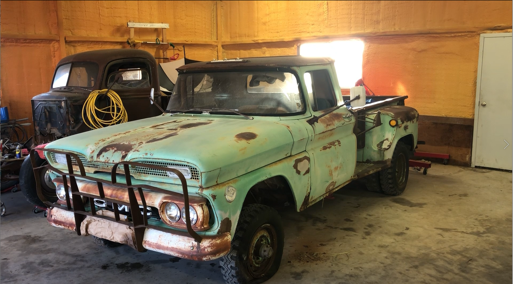

# 1961 GMC K1500 "Jimmy"
"Restoration" (as best I can) of my father's 1961 GMC K1502 named "Jimmy"

The goal of this project is to get this truck back on the road, at least enough to pass a normal safety inspection, and document the journey on [YouTube](https://www.youtube.com/playlist?list=PL5zrjhP8uTBTyOsT4I877-9L_4qDtNuRh) 

## History
My father purchased this truck in the late 60's from a seismograph company in Colorado, where it was used to move pieces of heavy equipment using a hydraulic crane that was fitted to the truck bed. I'm not sure how much or if at all this crane was used when my dad purchased it, but pieces of it are still on the property and the modifications are still part of the truck. My grandfather replaced the wooden bed with a steel plate and at some point wooden panels were installed to extend the sides of the bed upward. My earliest memory of the truck was playing in the grain in the bed as my dad was dumping more in it with his combine. Since then it's been a general farm workhorse and it has pulled everything from backhoes to houses, and when I graduated high school, it was the vehicle I chose to drive around the school in celebration of moving on.

This was our only truck until my dad bought a new Chevy Silverado in 1999 but we continued to keep the Jimmy registered and on the road. A few years later he purchased a Ford tractor which between it and the Silverado pretty much took up all the work the Jimmy was doing. It ended up sitting around outside although we would both make it a point to start it and drive it around a bit here and there. Sometime in the 2010's I replaced the old points ignition with an electronic module and installed a newly remanufactured carburetor in an effort to keep it running. 

In 2021 I was looking for something to do (weren't we all) and thought I'd try to get it running again, but this time, I'd take a video to show my father the progress I was making with his truck. At the time I had also discovered several "will it run" videos on YouTube and thought I'd throw this up just to see what happened. Much to my shock a bunch of folks really enjoyed the video which served as motivation to continue working on it and filming, both to show my father and my viewers. 

## Freeing Jimmy
The initial two videos of getting it running and pulled out from the hole it had sank into under it's own power.

## What's Ailing Jimmy?
Now that Jimmy is in the shop I perform an inspection of what we have and what needs to be done.

## One Short of a Six Pack
Figuring out why Jimmy is only running on five out of six cylinders.

## Jimmy's New Shoes
The fiasco of getting new wheels and tires to replace the rotted and dangerous split ring rims.

## Future Videos
I have a ton of footage and the historical holdup has been finding the time and motivation to edit and try to come up with a coherant video. This isn't helped by my tendency to jump from one thing to another without actually finishing anything, leaving a bunch of half started "projects" in my wake. However I think I have enough to make the following videos:

- Axle Hub Seals (rendering this one as I'm writing this)
- Brakes
- Electrical

## Additional Resources
This is a work in progress. My goal is to put everything Jimmy related into this Github page. This includes parts lists, schematics, photos, video links, and so forth. Stay tuned!

